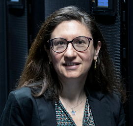
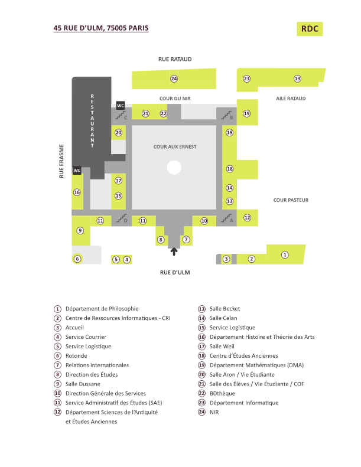

  
📅 **Lundi 17 novembre 2025**  
📍 **Salle Dussane, École Normale Supérieure (ENS), 45 rue d'Ulm, Paris**  

## Thème

**Raisonnement avec des données incertaines & Qualité des données**

Le GT **RECAST** a le plaisir d'annoncer sa première journée thématique, qui se tiendra à Paris.  
Cette journée sera l'occasion de réunir la communauté académique et industrielle autour des défis majeurs que représentent la gestion de l'incertitude et l'évaluation de la qualité des données.

## Thématiques principales  

La journée abordera des sujets tels que (liste non exhaustive) :  

- Représentation et raisonnement avec des données incertaines ou incomplètes.  
- Définition, mesure et garantie de la qualité des données (*Data Quality*).  
- Gestion de l'incohérence dans les bases de données et les systèmes d'information.  
- Impact de l'incertitude et de la qualité des données sur les processus décisionnels.  
- Approches formelles et pratiques pour le nettoyage, la validation et l'enrichissement des données.
  
## Programme

<table>
<tr>
<td>8:50-9:00</td>
<td><strong>Accueil</strong></td>
<td></td>
</tr>
<tr>
<td>9:00-10:00</td>
<td><strong>Exposé invité:</strong> <em>Meghyn Bienvenu</em></td>
<td> Repair-based semantics for querying inconsistent data: From databases to knowledge bases and back</td>
</tr>
<tr>
<td>10:00-10:30</td>
<td><strong>Pause café</strong></td>
<td></td>
</tr>
<tr>
<td>10:30-11:30</td>
<td><strong>Exposé invité:</strong> <em>Angela Bonifati</em></td>
<td> Reasoning over property graphs: Leveraging large language models for automated data consistency</td>
</tr>
<tr>
<td></td>
<td><strong>Session 1</strong></td>
<td><strong>Gestion de données incomplètes</strong></td>
</tr>
<tr>
<td>11:30-11:50</td>
<td><em>Aude Sportisse</em></td>
<td>Handling informative missing data </td>
</tr>
<tr>
<td>11:50-12:10</td>
<td>Leopoldo Bertossi, Maxime Buron, <em>Farouk Toumani</em></td>
<td>Query answering in incomplete databases under missingness mechanisms </td>
</tr>
<tr>
<td>12:10-13:45</td>
<td><strong>Pause déjeuner</strong></td>
<td></td>
</tr>
<tr>
<td></td>
<td><strong>Session 2 </strong></td>
<td><strong>Gestion de données incertaines ou incohérentes</strong></td>
</tr>
<tr>
<td>13:45-14:05</td>
<td><em>Fazia Rahmoune</em></td>
<td>Handling uncertainty in stochastic models </td>
</tr>
<tr>
<td>14:05-14:25</td>
<td><em>Mohamed-Amine Baazizi</em>, Dario Colazzo, Giorgio Ghelli, Carlo Sartiani, Stefanie Scherzinger</td>
<td>JSON Schema: From theory to practice </td>
</tr>
<tr>
<td>14:25-14:45</td>
<td><em>Yurun Gu</em></td>
<td>Leveraging inconsistency measures for query answer explainability </td>
</tr>
<tr>
<td>14:45-15:05</td>
<td><em>Ahmed Laouar</em>, Salem Benferhat</td>
<td>Inférence possibiliste traitable basée sur la fermeture à partir d’ontologies DL-Lite partiellement ordonnées </td>
</tr>
<tr>
<td>15:05-15:25</td>
<td><em>Maximos Skandalis</em></td>
<td>Qualité des données et approches neurosymboliques pour les tâches d’inférence textuelle et de détection automatique de contradictions </td>
</tr>
<tr>
<td>15:30-16:00</td>
<td><strong>Pause café</strong></td>
<td></td>
</tr>
<tr>
<td></td>
<td><strong>Session 3 </strong></td>
<td><strong>Gestion des incertitudes pour la robotique et dans des données spatio-temporelles</strong></td>
</tr>
<tr>
<td>16:00-16:10</td>
<td><em>Jean-Philippe Diguet</em>, Cédric Buche</td>
<td>Introduction of IRL CNRS CROSSING (Adelaide, Australia) </td>
</tr>
<tr>
<td>16:10-16:30</td>
<td><em>Feras Dayoub</em></td>
<td>Self-monitoring in robotic perception: Uncertainty, error detection, and evolving safety </td>
</tr>
<tr>
<td>16:30-16:50</td>
<td><em>Solenn Tual</em>, Nathalie Abadie, Joseph Chazalon, Bertrand Duménieu, Julien Perret</td>
<td>Interprétation sémantique de tables historiques : des sources anciennes aux graphes de connaissances </td>
</tr>
<tr>
<td>16:50-17:10</td>
<td><em>Charly Bernard</em>, Nathalie Abadie, Bertrand Duménieu, Julien Perret</td>
<td>Construction d’un référentiel géohistorique d’adresses à partir de multiples sources hétérogènes</td>
</tr>
<tr>
<td>17:10-17:30</td>
<td><em>Owen Crabtree</em>, Matthieu Latapy, César Ducruet</td>
<td>Effects of asymmetric cropping on data analysis: The case of Lloyd's list's monthly sampling</td>
</tr>
</table>

## Exposés invités

### Meghyn Bienvenu

**CNRS & Université de Bordeaux**

**Title:** Repair-Based Semantics for Querying Inconsistent Data: From Databases to Knowledge Bases and Back

**Abstract:** Consistent query answering was introduced twenty-five years ago as a principled means of querying inconsistent databases. It is based upon a simple idea: when it is impossible or infeasible to identify the true consistent database, then define instead a space of possible repairs (consistent databases that ‘minimally’ differ from the input database) and output those query answers that hold w.r.t. every repair. This approach has subsequently inspired an active line of research within the knowledge representation and reasoning community, which has extended and adapted the framework to the case of inconsistent knowledge bases (consisting of a dataset and an ontology). In this talk, I will survey recent advances on repair-based semantics and highlight the insights that have been gained, considering both the database and ontology settings.

**Bio:** Meghyn Bienvenu is a senior researcher (directrice de recherche) at the CNRS, based at the LaBRI research lab in Bordeaux, France.  Her research interests span a range of topics in AI and database theory, but she is best known for her contributions to knowledge representation and reasoning (KR), in particular, to ontology-mediated query answering and the study of logic-based methods for handling inconsistent data.  Bienvenu's research has been recognized by an invited Early Career Spotlight talk at IJCAI’16, the 2016 CNRS Bronze Medal in computer science, a keynote talk at KR 2024, and with her coauthors, a 2023 ACM PODS Alberto O. Mendelzon Test-of-Time Award and KR 2024 Ray Reiter Best Paper Award Runner-Up. She has taken on numerous responsibilities within the AI, KR, and database theory communities, notably serving as PC co-chair for KR 2021, associate editor of Artificial Intelligence Journal, and co-director of GDR RADIA. 

### Angela Bonifati

**Université Lyon 1, CNRS, University of Waterloo & IUF**

**Title:** Reasoning over Property Graphs: Leveraging Large Language Models for Automated Data Consistency

**Abstract:** Graph data structures are foundational for modeling complex
relationships across a wide range of domains, including the life
sciences, social media, healthcare, finance, security, and planning.
Property graphs, in particular, have emerged as a dominant paradigm
for encoding semantic relationships due to their expressiveness and
flexibility. However, the increasing adoption of graph databases has
intensified the need for robust mechanisms to ensure data quality and
consistency.
Traditional consistency maintenance techniques—such as domain-specific
rules and mined constraints like functional and entity
dependencies—face significant limitations in scalability, adaptability
to evolving data, and interpretability by non-experts. In this talk, I
will discuss the emerging role of Large Language Models (LLMs) as a
tool for automatically discovering and refining consistency
constraints in property graphs through guided natural language
prompts.
By bridging symbolic graph representations with the reasoning
capabilities of LLMs, I will also pinpoint promising directions for
automating integrity management in graph systems, along with a wide
array of graph-based reasoning tasks.

**Bio:** Angela Bonifati is a Distinguished Professor of Computer Science at
Lyon 1 University and at the CNRS Liris research lab, where she leads
the Database Group. She is also an Adjunct Professor at the University
of Waterloo in Canada from 2020 and a Senior member of the French
University Institute (IUF) from 2023. Her current research interests
are on several aspects of data management, including graph databases,
knowledge graphs, data integration and their applications to data
science and artificial intelligence. She has co-authored more than 200
publications in top venues of the data management field, including
five Best Paper Awards, two books and an invited paper in ACM Sigmod
Record 2018. She is a recipient of an ERC Advanced Grant 2024
dedicated to leading researchers in Europe. She is the
recipient of the VLDB Women in DB Research Award 2025 and of the IEEE
TCDE Impact Award 2023 as well as a co-recipient of an ACM Sigmod Research Highlights Award 2023.
She is the General Chair of VLDB 2026 and has served as the Program Chair of IEEE ICDE 2025, ACM Sigmod 2022 and EDBT 2020. She is currently an Associate
Editor for the Proceedings of VLDB Vol. 19 and for IEEE TKDE and ACM TODS.
She is the President of the ACM SIGMOD (2025-2029) and was the President of the EDBT Executive Board and Association (2020-2024). She is a member of the IEEE Technical Committee on Data Engineering (2024-2029) and a member of the PVLDB
Board of Trustees (2024- 2029).

## Informations pratiques et inscriptions  

La participation est **gratuite**, mais l'inscription est **obligatoire** pour des questions d'organisation.  

📅 **Date limite d'inscription : Jeudi 30 octobre 2025**  

**Instructions d'accès:** l'entrée se fait au 45 rue d'Ulm (point 3 sur le plan ci-dessous).  Après le passage par l'accueil, entrer dans le bâtiment par la porte principale. La salle Dussane se trouve au rez-de-chaussé, au bout du couloir de gauche (point 9 sur le plan).

Nous avons hâte de vous retrouver pour cet événement !  

**Le comité d'organisation de la journée du GT RECAST**  
Camille, Hazaël et Pierre-Henri  
